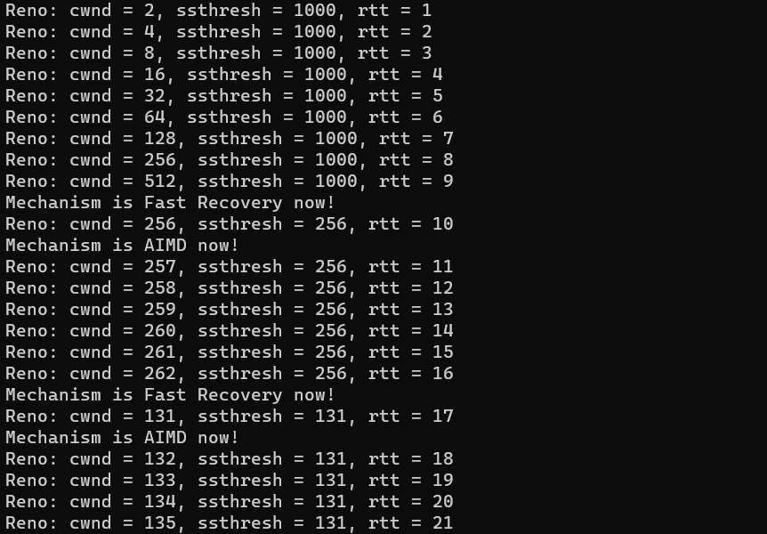
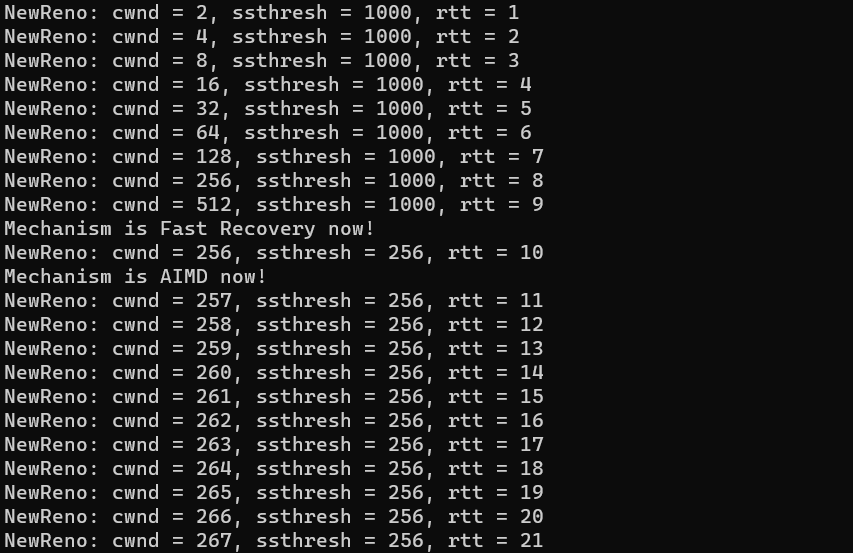

# CN_CHomeworks_4  
**Maryam Jafarabadi Ashtiani : 810199549**  
**Sana Sari Navaei : 810199435**  

- [Introduction](#introduction)
- [Algorithms](#algorithms)
    - [Reno](#reno)
    - [NewReno](#new-reno)
    - [BBR](#bbr)
- [Code Description](#code-description)
- [Results](#results)
- [Questions](#questions)
    - [Q1](#q1)
    - [Q2](#q2)
    - [Q3](#q3)
    - [Q4](#q4)
    - [Q5](#q5)
    - [Q6](#q6)

# Introduction  
This project focuses on studying TCP congestion control algorithms, specifically BBR, Reno, and New Reno. The goal is to understand how these algorithms manage data flow over a network and prevent congestion.  

# Algorithms  

## Reno  
The `Reno algorithm` is a widely used variant of TCP congestion control that incorporates slow start, congestion avoidance, and fast recovery mechanisms to regulate the sending rate of TCP traffic. It follows a multi-phase approach to optimize network utilization and ensure fairness among competing connections.  
The algorithm begins with a slow start phase, where the sender gradually increases the congestion window (cwnd) size to explore the network's capacity. As the cwnd grows, the sender can transmit more packets, effectively probing the available bandwidth.  
Once the cwnd reaches a certain threshold, the algorithm transitions to the congestion avoidance phase. In this phase, the cwnd is incremented by a smaller value for each acknowledgment (ACK) received. This helps maintain a steady sending rate while avoiding congestion.  
If a packet loss is detected, the algorithm enters the fast recovery phase. Instead of reducing the cwnd to 1 and restarting the slow start phase, as in the original TCP algorithm, Reno's fast recovery allows the sender to recover more quickly. It reduces the cwnd to half of its current value and increments it by one for each duplicate ACK received. This allows the sender to continue sending packets without a significant decrease in throughput.  
Overall, the Reno algorithm aims to achieve high network utilization while ensuring fairness among connections by dynamically adjusting the cwnd based on network conditions and responding efficiently to packet loss events.  

## New Reno  
TCP `New Reno algorithm` is the extension of TCP Reno. It overcomes the limitations of Reno.  
### Limitation Of Reno:  
- It takes a lot of time to detect multiple packet losses in the same congestion window.  
- It reduces the congestion window multiple times for multiple packet loss in the same window, where one reduction was sufficient.  

NewReno utilizes partial acknowledgements to handle packet loss within a congestion window. Unlike TCP Reno, when the sender receives the ACK of the first retransmitted packet, it does not consider it a **New ACK.** Instead, NewReno checks if all previously transmitted packets within that window have been acknowledged. If multiple packets are lost within the same congestion window, the receiver will continue sending duplicate ACKs even after receiving the retransmitted packet. This informs the sender that not all packets have reached the receiver, and the ACK is considered partial because only a portion of the window is acknowledged. Unlike Reno, NewReno does not exit the fast recovery phase upon receiving a partial ACK. It intelligently waits until it receives a cumulative ACK for the entire congestion window before ending the fast recovery phase. This allows NewReno to promptly detect multiple packet loss without prematurely exiting the fast recovery phase, distinguishing it from Reno's behavior.  

## BBR
`BBR` is a congestion control algorithm developed by Google to optimize network performance. It dynamically adjusts the sending rate based on the available bandwidth and round-trip time (RTT) of the network.  
The BBR algorithm has two main phases: startup and congestion avoidance. During the startup phase, BBR rapidly increases the sending rate to probe the available bandwidth. It measures the delivery rate and the minimum RTT to estimate the bottleneck bandwidth.  
Once the bottleneck bandwidth is determined, BBR enters the congestion avoidance phase. It aims to maintain a stable sending rate that does not exceed the estimated bottleneck bandwidth. BBR achieves this by using a model-based approach that adjusts the sending rate based on the observed RTT and the estimated bandwidth.  
One of the key advantages of BBR is its ability to react quickly to changing network conditions. It responds more efficiently to congestion signals compared to traditional algorithms like TCP Reno or Cubic. BBR achieves high throughput, low latency, and improved network utilization, making it well-suited for modern high-speed networks.  
BBR also considers the presence of competing flows in the network. It uses a mechanism called "proportional share" to allocate bandwidth fairly among different flows, ensuring that each flow receives its fair share of the available capacity.

# Code Description  
## Reno  
### sendData  
This function shows how to send a packet in the reno algorithm. First, we check that if the timeout has not reached its end, we do not send a packet. The function then enters a loop that iterates from AckTemp to the minimum value between DATA_SIZE (which represents the total size of the data) and AckTemp + cwnd (which represents the congestion window size). This loop is responsible for sending multiple data packets. Inside the loop, different modes are checked. The different modes are:  
- When a package is lost  
- When the package is sent to the recipient  
- When the number of acks received is equal to 3 or more  
In the third case, we have to resend the packets from where they were lost. The code of this section is as follows.  

```c++
void Reno::SendData()
{
  if (timeout != 0)
    return;

  int AckTemp = LastByteAcked;
  for (int i = AckTemp; i < DATA_SIZE && i < AckTemp + cwnd; i++)
  {
    bool lossProb = lossProbability();
    if(lossProb)
      counter += 1;
    else if(counter == 0)
    {
      LastByteAcked += 1;
      data_size -= 1;
    }
    else
    {
      AckLostPacket += 1;
      if (AckLostPacket == 3)
        break;
    }
  }
}
```

### onRTTupdate
The purpose of this function is to update the congestion window size (cwnd) based on the current congestion control mechanism.  
The function first checks the current mechanism and performs different actions accordingly.  
If the mechanism is Slow_Start, it checks if cwnd is equal to ssthresh. If it is, it changes the mechanism to AIMD. If cwnd is less than ssthresh, it multiplies cwnd by 2. If cwnd is greater than ssthresh, it sets cwnd equal to ssthresh.  
If the mechanism is Fast_Recovery, it changes the mechanism to AIMD and increments cwnd by 1.  
If the mechanism is AIMD, it simply increments cwnd by 1.  
```c++
void Reno::onRTTUpdate()
{
  if(mechanism == Slow_Start)
  {
    if (cwnd == ssthresh)
      change_mech(AIMD);
    if (cwnd < ssthresh)
      Mult_cwnd(2);
    else if(cwnd > ssthresh)
      cwnd = ssthresh;
  }
  else if(mechanism == Fast_Recovery)
  {
    change_mech(AIMD);
    increment_cwnd(1);
  }
  else if(mechanism == AIMD)
  {
    increment_cwnd(1);
  }
}
```

### onPacketLoss
The purpose of this function is to handle packet loss events and update the congestion window size (cwnd) and congestion control mechanism accordingly.  
The function first checks if the timeout value is equal to 0. If it is, it means that a timeout event has occurred. In this case, the function checks if AckLostPacket (the number of consecutive lost acknowledgments) is greater than or equal to 3. If it is, the function divides cwnd by 2, sets ssthresh to either cwnd or 1 (whichever is greater), changes the congestion control mechanism to Fast_Recovery, and returns 1.  
If AckLostPacket is not greater than or equal to 3, the function checks if counter is not equal to 0. In this case, the function divides cwnd by 2, sets ssthresh to either cwnd or 1, sets cwnd to 1, changes the congestion control mechanism to Slow_Start, sets the timeout value, and returns 1.  
If neither of these conditions is met, it means that the timeout value is not equal to 0. In this case, the function decrements the timeout value by 1 and returns 1.  
```c++
int Reno::onPacketLoss()
{
  if(timeout == 0)
  {
    if(AckLostPacket >= 3)
    {
      div_cwnd_by(2);
      ssthresh = cwnd > 1 ? cwnd : 1;
      change_mech(Fast_Recovery);
      return 1;
    }
    if(counter != 0)
    {
      div_cwnd_by(2);
      ssthresh = cwnd > 1 ? cwnd : 1;
      cwnd = 1;
      change_mech(Slow_Start);
      set_timeout();
      return 1;
    }
    return 0;
  }
  timeout -= 1;
  return 1;
}
```

## NewReno
The way of implementing the NewReno algorithm is almost similar to the Reno algorithm and they are slightly different only in the sendData() function. The difference is that sack is used here.  
Selective Acknowledgment (SACK) is used to improve the congestion control mechanism in TCP. SACK allows the receiver to inform the sender about the specific packets that have been successfully received, even if there are missing or out of order packets.  
```c++
void NewReno::SendData()
{
  if (timeout != 0)
    return;

  int AckTemp = LastByteAcked;
  for (int i = AckTemp; i < DATA_SIZE && i < AckTemp + cwnd + sack_counter; i++)
  {
    bool lossProb = lossProbability();
    if(acked[i])
    {
      if(counter == 0)
      {
        LastByteAcked += 1;
        data_size -= 1;
      }
      sack_counter += 1;
    }
    else if(lossProb)
    {
      counter += 1;
      acked[i] = 0;
    }
    else if(counter == 0)
    {
      LastByteAcked += 1;
      data_size -= 1;
      acked[i] = 1;
    }
    else
    {
      AckLostPacket += 1;
      acked[i] = 1;
      if (AckLostPacket == 3)
        break;
    }
  }
}
```

## BBR
### sendData
The function begins by checking if a timeout has occurred. If the timeout is not zero, it means that the sender is currently waiting for an acknowledgment and should not send any new data.  
A loop is then executed to send new data packets. Inside the loop, a check is performed to determine if there is a loss probability. This check simulates packet loss in a controlled environment for testing purposes. If there is a loss probability, the **counter** variable is set to 1, indicating that a packet loss has occurred. If there is no loss probability and the "counter" variable is zero. In this case, the **LastByteAcked** variable is incremented by 1 to acknowledge the successful receipt of the packet, and the **data_size** variable is decreased by 1 to account for the sent packet. The **acked** array is updated to indicate that the packet at index **i** has been successfully received (setting acked[i] to 1). If there is a loss probability and the **counter** variable is not zero, it means that consecutive packets have been lost. In this case, the loop breaks to stop sending new packets until the lost packets are retransmitted.  
Overall, this code snippet demonstrates the basic logic of sending data packets in the BBR algorithm, considering loss probabilities and acknowledging successful receipt of packets.  
```c++
void BBR::SendData()
{
    if (timeout != 0)
      return;
    
    int AckTemp = LastByteAcked;
    for (int i = AckTemp; i < DATA_SIZE && i < AckTemp + cwnd; i++)
    {
      bool lossProb = lossProbability();
      if(lossProb)
        counter = 1;
      else if(counter == 0)
      {
        LastByteAcked += 1;
        data_size -= 1;
        acked[i] = 1;
      }
      else
        break;
    }
}
```
### onPacketLoss
The function first checks if the counter variable is equal to 1 and the mechanism variable is set to Startup. This condition indicates that consecutive packets have been lost during the startup phase of the algorithm. In this case, the mechanism is changed to drain, which is a different congestion control mechanism.  
If the mechanism variable is already set to drain, it is changed to probeBW. This indicates that the algorithm should transition from the drain phase to the probe bandwidth phase after a packet loss event.  
Finally, the function returns 0, indicating that the packet loss event has been handled successfully.
```c++
int BBR::onPacketLoss()
{
  if(counter == 1 && mechanism == Startup)
    change_mech(drain);
  if (mechanism == drain)
    change_mech(probeBW);

  return 0;
}
```

# Results  
## Reno  
The output of the reno algorithm is as follows (due to the length of the output, the complete output has been avoided)  
  
As shown in the figure, the last rtt is 523.  
  
## NewReno  
The output of the new reno algorithm is as follows (due to the length of the output, the complete output has been avoided). In reno and new reno algorithm, the mechanism is slow start at first. Then we go to fast recovery mode and then aimd. After that, the fast recovery mechanism and aimd are moved one by one, and if we draw its shape, the diagram will be in the form of consecutive triangles.  
  
As shown in the figure, the last rtt is 519. So it can be concluded that the new reno algorithm works a little better than the reno algorithm, even though many of their functions are the same. This performance improvement is due to the presence of sack in the new reno algorithm.  
  
## BBR  

# Questions  

## Q1  
Congestion control and flow control are two important mechanisms in computer networks that work together to ensure efficient and reliable data transmission.  
Congestion control is primarily concerned with managing and preventing network congestion. Network congestion occurs when the demand for network resources exceeds the available capacity, leading to degraded performance, increased packet loss, and delays. The goal of congestion control is to regulate the rate at which data is sent into the network to prevent congestion from occurring or to alleviate it if it does occur.  
On the other hand, flow control operates at the transport layer and focuses on regulating the flow of data between the sender and receiver. It ensures that the receiver can handle the incoming data at a pace it can process without overwhelming its buffer capacity. Flow control prevents the sender from transmitting data faster than the receiver can handle, avoiding data loss or buffer overflow situations.  
In summary, congestion control manages and prevents network congestion to optimize overall network performance, while flow control regulates the flow of data between sender and receiver to ensure a smooth and efficient data transfer process. Both mechanisms work together to ensure reliable and efficient communication in computer networks. 

## Q2  
TCP New Reno is an enhanced congestion control algorithm that improves upon the original TCP Reno algorithm. It effectively handles packet loss and congestion by implementing a fast recovery phase. When packet loss is detected, instead of reverting to slow start, the sender enters fast recovery. During this phase, the sender continues to send new packets, known as "partial acknowledgments," to maintain a higher sending rate and expedite congestion recovery.  
Once all lost packets are successfully retransmitted and acknowledged, the sender exits fast recovery and transitions to the congestion avoidance phase. In this phase, the sender gradually increases the congestion window size to prevent triggering congestion again.  
TCP New Reno optimizes TCP congestion control by reducing the time required to recover from packet loss and congestion, resulting in improved throughput and responsiveness.  

## Q3  
TCP BBR (Bottleneck Bandwidth and Round-trip propagation time) is a congestion control algorithm developed by Google.  
It aims to achieve higher bandwidth and lower latencies for internet traffic. BBR differs from traditional loss-based congestion control algorithms by using measurements of the network's available bandwidth and round-trip time to adjust the sending rate. It operates at the point just before the onset of queuing, optimizing the flow's ability to utilize network resources without causing excessive delays or packet loss.  

## Q4  
- BBR and Reno:  
    - improved throughput: BBR is designed to maximize network throughput by dynamically estimating the available bandwidth and adjusting the sending rate accordingly. This can result in higher throughput compared to Reno.  
    - Complexity: BBR is more complex than Reno and requires more sophisticated algorithms to estimate the available bandwidth and adjust the sending rate.  
    - Reduced latency: BBR aims to minimize queuing delay and round-trip time (RTT) by probing the network to find the optimal sending rate. This can lead to lower latency and improved responsiveness for interactive applications.  
- Reno and NewReno:  
    - The main difference is that TCP Reno can't distinguish between full ACK and partial ACK while new Reno can. Therefore multiple packet loss is detected by new Reno. In context of protocol, TCP new Reno remains in the fast recovery until all the outstanding packets are acknowledged.  

## Q5  

## Q6  
- TCP Vegas: TCP Vegas uses round trip time for the increase or decrease of the congestion window. Expected and current throughput is measured whose difference is compared with some min and max threshold values. On the basis of the comparison we increase, decrease, or don’t change the congestion window.  
- TCP cubic: TCP CUBIC is a congestion control algorithm that arises with the idea of taking advantage of the fact that today’s communications links tend to have increasingly higher bandwidth levels.  
In a network composed of wide bandwidth links, a congestion control algorithm that slowly increases the transmission rate may end up wasting the capacity of the links.  
The intention is to have an algorithm that works with congestion windows whose incremental processes are more aggressive, but are restricted from overloading the network.  
- Proportional Rate Reduction: This algorithm determines the amount of data sent by TCP during loss recovery. PRR minimizes excess window adjustments, and the actual window size at the end of recovery will be as close as possible to the ssthresh, as determined by the congestion control algorithm.  

TCP Vegas has several advantages over TCP Reno and TCP New Reno. One of them is that it can achieve high throughput and low delay, as it avoids congestion and packet losses by maintaining a small buffer at the bottleneck link. Another one is that it can be fair to other TCP Vegas flows, as it allocates the bandwidth proportionally to the RTT of each flow.  
